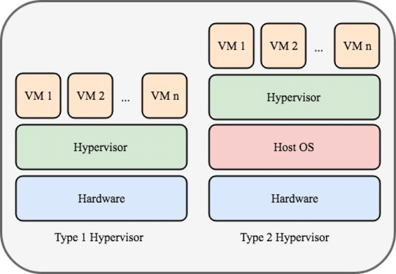

# Types of Clouds

Temel olarak 4 tane cloud modeli olduğundan bahsedebiliriz;

## Public Clouds

Genel popülasyona hizmet sunan bir cloud çeşididir. Ücretli veya ücretsiz olabilirler ve hizmetlerini internet üzerinden sağlarlar. Örneğin bu hizmet, bir online depolama hizmeti olabilir.

## Private Clouds

Bu tür cloud servisleri, hükümet gibi özel olarak bir organizasyona ya da varlığa sunulur. Private cloudlar, erişim güvenliği sağlanarak uzaktan bir organizasyon tarafından da kontrol edilebilir.

## Hybrid Clouds

İki veya daha fazla cloud'dan oluşur. Bu iki cloudun her biri ayrı bir parça olarak kalır ama ikisi de tek bir mimari kullanılarak bağlanır.

## Community Clouds

Adından da anlaşılacağı üzere, belirli bir topluluk tarafından özel bir kullanım amacı için oluşturulur. Public cloudlar ile farkları, spesifik bir topluluk için özelleştirilmiş ihtiyaçları karşılamasıdır. Örneğin, sağlık kuruluşları özel kimlik doğrulama ve gizlilik gerektiren politikalara ve yasalara uyumlu kalmalıdır.

# Cloud Computing and Virtualization

Bu iki kavram genelde birbiri yerine kullanılarak karıştırılır ama aslında farklı şeylerdir. Virtualization, cloud computingin temelini oluşturur. Virtualization olmasaydı cloud computing'in bu kadar yaygın olarak kullanılması mümkün olmazdı.

On yıllar önce, VMware bir host işletim sisteminin üstüne bir veya birden fazla işletim sistemi kurulabilmesini sağlayan bir sanallaştırma teknolojisi geliştirdi. Şimdiki bir çok virtualization teknolojileri burada kullanılan teknolojiyi baz alıyor. Bununla beraber dedicated serverlerın da sanallaştırılması söz konusu olup, data centerlar ve enterprise networklerde hızla uygulanmaktadır.

Virtualization, bilgisayar gibi fiziksel bir şeylerin sanal versiyonunun oluşturulmasıdır. Örneğin, Windows PC'nizde Linux çalıştırmak isteyebilirsiniz.

Virtualizationu tam olarak kavrayabilmek için ilk önce server teknolojisinin kökenlerini anlamak gerekir. Enterprise serverlar, belirli bir donanıma yüklenen "Windows Server" veya "Linux Server" gibi bir sunucu işletim sisteminden oluşuyordu. Sunucunun tüm kaynakları (RAM, CPU, Storage) sağlanan hizmet için ayrılmıştı. Bu yapılandırmanın en büyük problemlerinden biri, bir donanımda hata olduğunda tüm serverın kullanılamaz olmasıydı. Bu hatalara biz "Single Point of Failure (SPOF)" diyoruz. Bununla beraber başka bir sorun ise, dedicated serverların sunulan şeklinden çok daha az kullanılmasıydı. Bu sunucular genellikle uzun süreler boyunca boşta kalıyor ve sağladıkları hizmet kullanılana kadar bekliyorlardı. Ayrıca gereksiz enerji tüketiyorlar ve sağlanan hizmetin karşılığından çok daha fazla alan kaplıyorlardı. Bu ikisi ayrıca "Server Sprawl" olarak bilinir.

# Virtualization

Sanallaştırmanın avantajları şu şekilde sıralanabilir;

• Sanallaştırma, daha az fiziksel cihaz gerektiren ve bakım maliyetlerini düşüren sunucu consolidation'una (konsolidasyon yani birleşme) olanak tanır.

• Çok daha az enerji tüketir.

• Server consolidationu ayrıca daha az alanın tüketilmesini sağlar.

• İzole ağlarda çalışan bağımsız laboratuvarlar, ağ dağıtımlarının test edilmesi için hızla oluşturulabilir.

• Daha hızlı server provisioning'i sağlar. Provisioning IT endüstrisinde, donanımları, ağları ve diğer kaynakları içeren IT altyapısını kurma ve verileri sistemler ile kullanıcılara sunma sürecine denir.

• Çoğu sunucu sanallaştırma platformu artık gelişmiş "Redundant Fault Tolerance" özellikleri sunuyor. Böylece sunucular daha uzun süreler boyunca aksaklık yaşanmadan açık kalabiliyor.

• Çoğu kurumsal sunucu sanallaştırma platformunda, bir problem gerçekleşmeden önce yedeklemeyi test etmeye ve otomatikleştirmeye yardımcı olabilecek yazılımlar bulunur. Bu yüzden de gelişmiş "recovery" sağlar.

• Sanallaştırma, işletim sistemlerinin ve uygulamaların ömrünü uzatarak kuruluşlara daha yeni çözümlere geçiş için daha fazla zaman sağlayabilir.

## Hypervisors

Hypvervisors, fiziksel donanımın üstüne abstraction layer (soyutlama katmanı) olarak yerleştirilmiş bir firmware, hardware ya da program olabilir. Abstraction layer, makinenin CPU, memory, disk controllers ve NICs gibi donanım kaynaklarına erişilmesine olanak tanıyan sanal makineler oluşturmak için kullanılır. Bu sanal makinelerin her biri, ayrı ve eksiksiz bir işletim sistemi çalıştırır. Sanallaştırma ile 100 adet fiziksel sunucunun, hypervisor kullanan 10 adet fiziksel sunucunun üzerinde sanal makine olarak konsolide edilmesi olağandışı bir durum değildir.

### Type 1 - Bare Metal Hypervisor

Bu hypervisorlar, doğrudan donanıma kurulması nedeniyle "bare metal" olarak adlandırılır. Bu tür hypervisorlar, genelde enterprise serverlarda ve data centerlarda kullanılır. Type 1 hypervisorlarda, hypervisor doğrudan sunucuya veya ağ donanımına kurulur. Daha sonra, hypervisora bir işletim sisteminin örnekleri kurulur. Type 1 hypervisorlar donanım kaynaklarına doğrudan erişime sahiptir; bu nedenle, hosted mimarilerden daha verimlidirler. Type 1 hypervisorlar ölçeklenebilirliği, performansı ve sağlamlığı artırır.

### Type 2 - Hosted Hypervisor

Aşağıdaki şekilde de görüldüğü gibi Type 2 hypervisorlar, donanımın üstüne kurulmuş mevcut bir işletim sisteminin üstüne bir abstarction layer ekleyerek onun da üstüne işletim sistemi kurulabilmesine olanak tanır. Bu hypervisorların en büyük avantajlarından biri, "Management Console Software" gerektirmemeleridir. Hostun kaynaklarının tükenmemesi için kaynaklar doğru şekilde paylaştırılmalıdır.

