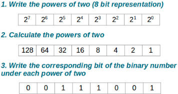
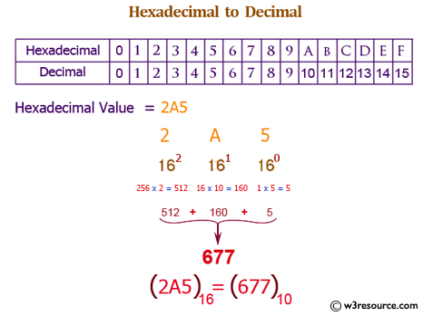
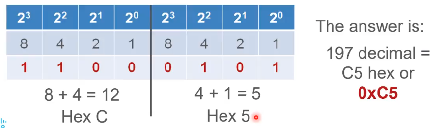

# Binary to Decimal and Decimal to Binary Conversions

Adreslerin sadece 1 ve 0'lardan yani binary sayı sisteminden oluşmasının insanlar tarafından okunması için oldukça zor olacağını söylemiştik. Bu yüzden insanlar binary'i decimal'a çeviriyor. Bizim de ağ adreslemesini tam olarak öğrenmemiz için bu dönüşümleri bilmemiz gerekir. 

#### NOT: Binary sayı sistemi sadece 0 ve 1'lerden oluşurken decimal sayı sistemi, 0'dan 9'a kadar 10 farklı değer alabilir.

Yukarıdaki şekilde de görüldüğü gibi, decimal olarak ifade edilmiş bir sayıyı binary'e çevirirken; Önce binary sistemi olduğu için tabanı 2 olarak alırız. Daha sonrasında insanlar için bitten daha anlamlı olan 1 byte kadar yani toplamda 8 bit kadar tabloyu genişletiriz (Aynı zamanda IPv4 adresinin bir oktetine karşılık geldiği için). Bu da üs olarak 0'dan 7'ye tekabül eder. Sonra bu üslerin sonuçları alınarak, sonuçlarının tek tek baştaki sayının içinde olup olmadığı kontrol edilir. Yoksa 0, varsa 1 yazılır.

Binary bir gösterimi decimal'a çevirmek için de bunun tam tersi uygulanır. 1 bit değerine tekabül eden sayılar toplanır ve sonucunda bir decimal gösterim elde edilir. Örneğin yukarıdaki sayı, 1 değerlerini topladığımızda 57'ye tekabül eder. Yani "57" bizim decimal gösterimimizdir.

# Decimal to Hexadecimal and Hexadecimal to Decimal Conversions

Hexadecimal numbering system, ağlarda IPv6 adreslerini ve MAC adreslerini ifade etmek için kullanılır. IPv6 adresleri 128 bit uzunluğundadır ve her 4 bit tek bir onaltılık haneyle temsil edilir. Bu da toplamda 32 tane haneye tekabül eder. Önceden de bahsettiğim gibi IPv6 adresleri büyük/küçük harfe duyarlı değildir. Bu nedenle büyük veya küçük harflerle yazılabilir. Her hextet 16 bitten veya başka bir deyişle 4 hexadecimal haneden oluşur. Dolayısıyla toplamda 8 hextet vardır.

Decimal to Hexadecimal için ise, önce decimal değerleri binary'e çeviririz, daha sonrasında binary gösterimi ortadan ikiyi ayırırız. Böylece 4-bit ve 4-bit şeklinde ayrılmış olur. 

Daha sonrasında soldaki 4-bitlik kısmındaki 1 olan değerleri ayrı, sağdaki 4-bitlik kısmın 1 olan değerlerini ayrı toplarız. 12 Decimal gösterimi, hexadecimal gösterimde "C" sembolüne tekabül eder. Böylece sonuç olarak "C5" gösterimini elde ederiz.
