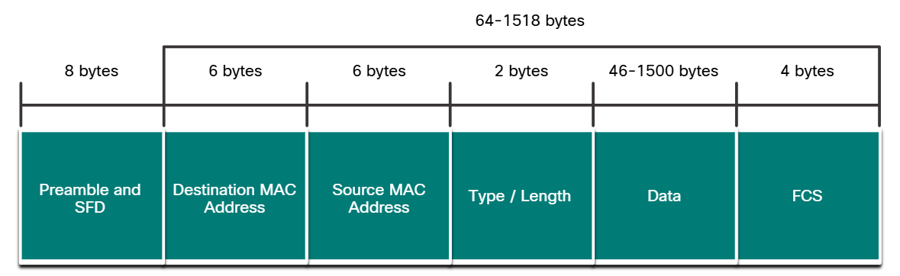

# Ethernet 

Networking'in ilk yıllarında her üretici kendi interconnecting network cihazlarını ve networking protokollerini kullanıyordu. Bu yüzden, farklı üreticilerden ekipman alındığında, onların birlikte çalışabileceği garanti edilemiyordu. Networkler yaygınlaşmaya başladığında, farklı üreticileri aynı noktada birleştirmeye yarayan çeşitli kurallar tanımlanarak standartlar oluşturuldu.

Uzun bir süre boyuncu resmi bir şekilde kullanılan local area networking protokol standartı yoktu. Ancak zamanla ethernet diğerlerinden çok daha popüler hale geldi. Ethernet protokolleri, verinin nasıl biçimlendirileceğini ve wired network üzerinden nasıl iletileceğini tanımlar. Ayrıca ethernet standartları, OSI modelinin 1. ve 2. katmanlarını yönetir. Ethernet teknolojisi daha popüler hale gelmesiyle beraber artık bir standart haline gelmişti ve neredeyse tüm wired local area networklerinde ethernet kullanılıyordu.

The Institute of Electrical and Electronics Engineers, ya da IEEE, ethernet ve wireless standartlarının da dahil olduğu networking standartlarını yönetir. IEEE komiteleri, bağlantılar için standartları, medya gerekliliklerini ve iletişim protokollerini yönetmek ve onaylamakla yükümlüdür. Her standarta, hangi komitenin o standartı onaylayıp yönettiğini belli edecek şekilde bir sayı atanmıştır. Ethernet standartlarından sorumlu olan komite, 802.3'tür. 

Ethernetin 1973'te ortaya çıkmasından bu yana, zamanla bu teknolojiyi geliştirmek için çeşitli standartlar öne sürüldü. Ethernetin bu zamanla gelişebilme özelliği onu popüler yapan ana nedenlerden bir tanesidir. Ethernet'in her sürümünün kendine özgü bir standardı vardır. Örneğin 802.3 100BASE-T, twisted-pair kablo standartlarını kullanan 100 Megabit ethernet'i temsil eder. Buradaki "100 Mbps" ifadesi hızını, "BASE" ifadesi baseband iletimi kullanıldığını ve "T" ifadesi ise kablonun türünü yani buradaki ifadeye göre de twisted-pair olduğunu temsil eder.

Ethernetin ilk versiyonları maksimum 10 Mbps'a kadar desteklerken, günümüzde ise ethernetin saniyede 1.6TbE (Terabit Ethernet) desteklemesi için kullanılacak standartın da geliştirme aşamasında olduğunu söyleyelim. Bunun haricinde, günlük kullanımda 1GbE ve 10GbE yaygın olsa da, veri merkezleri ve büyük ağ altyapılarında 100GbE ve üzeri hızlar kullanılıyor.

# Ethernet Frames

Ethernet, wireless (WLAN) ile beraber günümüzde kullanılan 2 farklı LAN teknolojisinden biridir. Ethernet teknolojisi, twisted-pair, coaxial kablo ve fiber optik gibi kabloları kullanarak kablolu iletişime olanak tanır. Ethernet, data link layerda ve physical layerda çalışır. IEEE 802.2 ve 802.3 standartlarında tanımlanan bir ağ teknolojileri ailesidir.

## Data Link Sublayers

Ethernetin de dahil olduğu IEEE 802 LAN/MAN protokollerinin çalışabilmesi için yani data link layer'ın yönetilebilmesi için bu katman, "Logical Link Control (LLC)" ve "Media Access Control (MAC)" adı verilen iki farklı sublayer'e bölünmüştür.

### LLC Sublayer

IEEE 802.2 sublayer'ı, üst katmanlardaki ağ yazılımları ile alt katmanlardaki cihaz donanımları arasında iletişim kurar. Frame'in içine, hangi network layer protokolünün kullanıldığının bilgisini ekler. Bu bilgi, birden fazla Layer 3 protokolünün (IPv4 ve IPv6 gibi) aynı network interface ve media üzerinde çalışmasını sağlar.

### MAC Sublayer

Bu sublayer (örneğin IEEE 802.3, 802.11 veya 802.15) donanıma entegre edilmiştir ve veri encapsulation'ını ile media access control'ünü sağlar. Data link layer adreslemesini sağlar ve çeşitli physical layer teknolojileriyle (yani twisted-pairlar, fiber optik kablolar veya kablosuz iletim sağlayan bluetooth ve RFID, NFC gibi teknolojiler) entegre olarak çalışır.

#### Data Encapsulation

MAC Sublayer'ının data encapsulation ve medyaya erişim sağlamakla sorumlu olduğunu söylemiştik. Data encapsulationa şunlar dahil olabilir;

##### Ethernet Frame -> Ethernet frame'inin iç yapısını oluşturur.

##### Ethernet Addressing -> Frame'in içine source MAC adresi ve destination MAC adresi koyarak verinin NIC'ten NIC'e iletilmesine olanak tanır.

##### Ethernet Error detection -> Ethernet frame'i, frame check sequence (FCS) adı verilen bir hata kontrol trailer'ine sahiptir.

#### Accessing the Media

IEEE 802.3 MAC sublayerı, bakır ve fiber gibi çeşitli medya türleri üzerinden farklı Ethernet iletişim standartlarına ilişkin özellikleri içerir. Örneğin, IEEE 802.3z standartı, fiber üstünde gigabit ethernet destekler.

# Ethernet Frame Fields

Minimum ethernet frame'inin boyutu 64 byte ve beklenen maksimum boyutu ise 1518 byte'tır. Bu, destination MAC adresi alanından frame check sequence (FCS) alanına kadar olan tüm baytları içerir. Frame boyutu tanımlanırken "Preamble" alanı dahil edilmez. 64 bayttan küçük olan herhangi bir frame "collision fragment" ya da "runt frame" olarak adlandırılır ve alıcı istasyonlar tarafından otomatik olarak atılır. 1500 bayttan fazla veri içeren frame'ler ise "jumbo" ya da "baby giant frame" olarak adlandırılır. Alıcı cihazlar nasıl 64 bayttan az olduğunda frame'i dropluyorsa, 1500 bayttan fazla olduğunda da frame'i droplarlar. Bu tür droplanan frame'lere collisionslar (çarpışmalar) veya istenmeyen sinyaller sebep olabilir. Bununla beraber jumbo frame'lerin çoğu Gigabit Ethernet ve Fast Ethernet destekleyen switchler ile NIC'ler tarafından kabul edilir.

## Preamble and Start Delimiter Fields

7 byte olan Preamble ve 1 byte olan Start Frame Delimiter (SFD) ya da diğer adıyla Start of Frame, gönderici ve alıcı cihaz arasındaki senkronizasyon için kullanılır. Bu ilk 8 byte, alıcı node'ları uyarmak için kullanılır. Aslında ilk birkaç byte, alıcılara yeni bir frame almaları için hazır olmaları gerektiğini söyler.

## Destination MAC Address Field

Bu 6 byte'lık alan alıcıyı tanımlar. Ayrıca unicast, multicast veya broadcast adresi olabileceğini unutmayalım. 

#### NOT: Destination MAC adresi daima source MAC adresinden önce yer alır. İlk önce dest. adresi okunur böylece bilhassa switchlerin daha hızlı yönlendirme yapmasına olanak tanınır. (Örneğin dest. adresi bir broadcast adresiyse, switch bu frame'i, gelen port hariç tüm portlara direkt yollayabilir.)

## Source MAC Address Field

Bu 6 byte'lık alan da kaynağı tanımlar. Yani aslında kaynak NIC adresidir.

## Type/Length

Bu 2 byte'lık alan ise, ethernet frame'inin içine encapsulate edilen bir üst katman protokolünü ifade eder. Bir üst katman protokolleri IPv4 (hexadecimal gösterim olarak -> 0x800), IPv6 (0x86DD) veya ARP (0x806) gibi protokoller olabilir. Ayrıca bu alanın, EtherType olarak da adlandırıldığını görebilirsiniz.

## Data Field

Bu alan 46 - 1500 byte arasında, üst katman tarafından encapsulate edilmiş, genellikle layer 3 PDU veya daha genel kullanım olarak IPv4 paketlerini içerir. Tüm frame'ler en az 64 byte uzunluğunda olmalıdır demiştik. Eğer küçük bir paket encapsulate edilirse, frame'in boyutunu arttırmak için "pad" adı verilen ek bitler eklenir.

#### NOT: Layer 3 PDU (Protocol Data Unit), çeşitli Layer 3 protokollerinin paketlerini genel olarak temsil etmek için kullanılır. Yani layer 3 pdu diyince buna, IPv4, IPv6, ARP, ICMP gibi protokol paketleri de dahildir.

## Frame Check Sequence Field

4 byte'tan oluşan bu alan, framedeki hataları tespit etmek için kullanılır. Bunu yapmak için, "Cyclic Redundancy Check (CRC)" kullanır. Gönderici cihaz CRC sonuçlarını, FCS alanına dahil eder. Alıcı cihaz frame'i aldığında hatalara bakmak için CRC oluşturur. Eğer iki cihazın da oluşturduğu CRC'ler eşleşirse, hata meydana gelmemiş demektir. Fakat eşleşmemesi durumunda verinin değişime uğradığı söylenebilir ve bu yüzden de frame droplanır. Bu değişim, bitleri temsil eden elektrik sinyallerindeki bir bozukluğa işaret edebilir.

# Ethernet MAC Address

Ethernet MAC adresleri, 48 bitlik binary değer içerir. MAC adresleri hexadecimal sayı sistemini kullanır çünkü tek bir hexadecimal hanesi 4 biti temsil eder. Böylece 48 bitlik bir gösterim, 12 hexadecimal hane ile ifade edilmiş olur. Genelde daha anlamlı olduğu için 8 bitlik bir gösterim tercih edildiğini söylemiştik ki aynı şey MAC adreslerin gösterimi için de geçerlidir. 8 bitlik gösterimi tamamlamak için, bir grup sadece 0'lardan oluşsa bile yine de belirtilir. Örneğin, 0000 1010 ifadesi 0A olarak gösterilir. Hexadecimal sayılar dökümanlarda belirtilirken "0x" ile başlayan değerler ile ifade edilir (Örneğin, 0x73 gibi). Ayrıca hexadecimal sayı sistemi, 16 subscript'i ile (73₁₆) ya da "H" ile de ifade edilebilir (73H gibi).

## Unicast MAC Address

Ethernette, unicast, multicast ve broadcast adreslerinin kullanılabileceğinden bahsetmiştik. Unicast MAC adresi eşsiz olarak sadece spesifik bir destination cihazını tanımlayan adrestir.

#### NOT: Source MAC adresi daima unicast adresi olmalıdır. (Bu özellikle, hedef cihazın hangi cihaza cevap göndereceğini bilmesi için önemlidir.)

## Broadcast MAC Address

Ethernet Broadcast Frame'i, Ethernet LAN'indeki her cihaz tarafından alınır ve işlenir. Broadcast MAC adresi, FF-FF-FF-FF-FF-FF olarak ifade edilir. Gönderenin portu hariç tüm portlara iletilir ve routerlar tarafından yönlendirilmez. Eğer encapsulate edilmiş veri bir IPv4 broadcast paketiyse, destination IPv4 adresinin host portion'u sadece 1'lerden oluşacak şekilde ayarlanır. Adresteki bu numaralama IPv4 paketinin, o local network yani aslında o broadcast domain içerisindeki tüm cihazlara iletilmesi gerektiğini söyler. Böylece o broadcast domain içerisindeki tüm hostlar, bu paketi alır ve işler. Bir örnek olarak, IPv4 adres bilgileri için kullanılan DHCP protokolü, ethernet ve IPv4 broadcast paketlerini kullanır.

#### NOT: Tüm ethernet broadcastleri, IPv4 broadcast paketini kullanmazlar. Örneğin ARP de bir layer 3 PDU'sudur ama sadece ethernet broadcastini kullanır.

## Multicast MAC Address

Ethernet multicast frame'i, multicast grubuna dahil olan tüm cihazlar tarafından alınır ve işlenir.

Encapsulate edilmiş verilerin, eğer bir IPv4 multicast paketini içeriyorsa 01-00-5E, IPv6 multicast paketini içeriyorsa da 33-33 destination multicast MAC adresi vardır. Bunun haricinde encapsulate edilmiş veriler IP içermediğinde, örneğin, Spannig Tree Protocol (STP) ve Link Layer Discovery Protocol (LLDP) gibi protokolleri içerdiğinde daha farklı multicast MAC adresleri söz konusu olur. 

Switch, multicast snooping ile yapılandırılmadığı sürece paket, gelen port hariç tüm portlara yönlendirilecektir. Ayrıca router, multicast paketlerini yönlendirecek şekilde yapılandırılmadıysa, bu paketler farklı bir ağa yönlendirilmezler.

Encapsulate edilmiş veriler IP multicast paketi ise, multicast grubuna dahil olan cihazlara bir multicast IP adresi atanır. IPv4 multicast adreslerinin aralığı, 224.0.0.0 ile 239.255.255.255 arasındadır. IPv6 multicast adresleri ise, ff00::/8 ile başlar. Bu adreslerin de sadece dest. adresi olarak kullanılabileceğini, bunun haricinde source adresi olarak kullanılamayacağını ve source adresinin sadece unicast adresi olabileceğini de hatırlatalım.

Unicast ve broadcast adreslerinde olduğu gibi, multicast IP adresi, yerel bir ağda frameler sunmak için karşılık gelen bir multicast MAC adresine ihtiyaç duyar. Multicast MAC adresi, IPv4 veya IPv6 multicast adresiyle ilişkilendirilir ve bu adresleme bilgisini kullanır. Örneğin, 224.0.0.200 adresine karşılık 01-00-5E-00-00-C8 şeklinde bir MAC adresi belirlenir.

Routing protokolleri ve diğer network protokolleri multicast adreslemesini kullanır. Video ve görüntüleme yazılımı gibi applicationlar multicast adreslemesini kullanabilir, ancak multicast app. o kadar yaygın değildir.

# MAC Address Table

MAC adreslemeleri ile ilgili bilgiler edindiğimize göre sıra switchlerin bu adresleri ne şekilde yönlendirdiğine ya da discard (atmak) ettiğine geldi. Switch aldığı her frame'i tüm portlara iletseydi, ağ muhtemelen durma noktasına gelirdi.

Layer 2 ethernet switchleri adın da anlaşılacağı üzere, Layer 2 MAC adreslerini kullanarak yönlendirme yapar. Bu yüzden de frame'in "data" kısmında taşınan verilerden (yani IPv4, ARP, IPv6 gibi protokollerden) haberi yoktur. Sadece Layer 2 ethernet MAC adreslerini kullanır. Bir Ethernet switchi, gelen port hariç tüm portlara giden bitleri tekrarlayan eski Ethernet hub'larının aksine, her frame için ayrı bir yönlendirme kararı vermek üzere MAC adres tablosunu inceler. Bu MAC table, aynı zamanda "Content Addressable Memory (CAM)" şeklinde de ifade edilebilir.

Switchler, portlardan aldığı frame'lerin source MAC adres kısmını ve o frame'in hangi porttan geldiğini inceleyerek tablosuna dinamik olarak, porta karşılık gelen MAC adresi şeklinde ekler. Böylece dest. MAC adresiyle hangi port eşleşiyorsa onu gelen port hariç tüm portlara yönlendirmeden direkt olarak ilgili porta yönlendirir. Eğer daha önceden o porta karşılık gelen MAC adresi tabloya eklenmiş ama tekrardan aynı source MAC adresine sahip bir cihazdan frame alırsa, o port ve MAC adresi için ayırdığı süreyi günceller. Default olarak çoğu ethernet switchi, tablosunda bu bilgiyi 5 dakika tutar. Bunun haricinde kaynak MAC adresi tabloda mevcutsa ama bu sefer farklı bir porttan geliyorsa, switch onu en güncel olduğu port ile güncelleyecektir.

Eğer yönlendirme yapılırken dest. MAC adresi switchin tablosunda yer almıyorsa, frame geldiği port hariç tüm portlara iletilmelidir. Bu işlem "unkown unicast" olarak adlandırılır. Burada dikkat edilmesi gereken nokta, switchin burada yaptığı yayının bir "broadcast" değil de "unkown unicast" olarak adlandırılmasıdır. Bunun sebebi, switch bu işlemi, tablosunda MAC adresine karşılık gelen portu bulamadığı için yapar. Eğer bir broadcast mesajından bahsedecek olursak, bu switchin tablosundaki girdilerle ilgili değil, frame'in tüm cihazlara iletilmesi gerektiği için (Örneğin bir ARP sürecinin gerçekleşmesi için) broadcast olarak gönderildiğini söylememiz gerekir. Yani unkown unicast'e switch kendi tablosunda girdi bulunmadığı için karar verirken, bir broadcast mesajını, kullanılan protokol broadcast mesajı yollanmasını söylediği için yapar.

Bir switch, tek bir portla ilişkilendirilmiş birden fazla MAC adresine sahip olabilir. Bu, switch başka bir switche bağlandığında yaygındır. Switch, farklı bir source MAC adresiyle alınan her frame için ayrı bir MAC adresi tablosu girişine sahip olacaktır.

Ayrıca, bir cihazın uzak bir ağda bulunan bir IP adresi olduğunda, Ethernet frame'i doğrudan hedef cihaza gönderilemez. Bunun yerine, Ethernet frame'i default gateway'in, yani routerın MAC adresine gönderilir.

