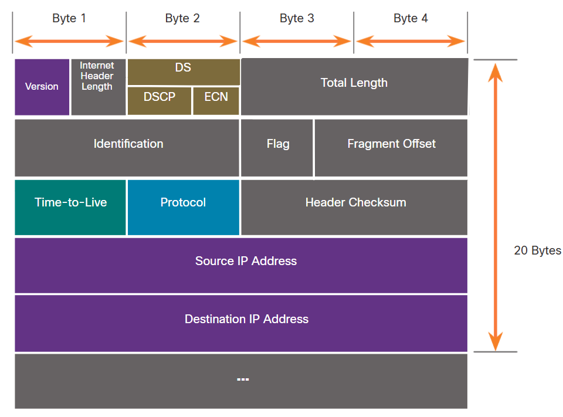
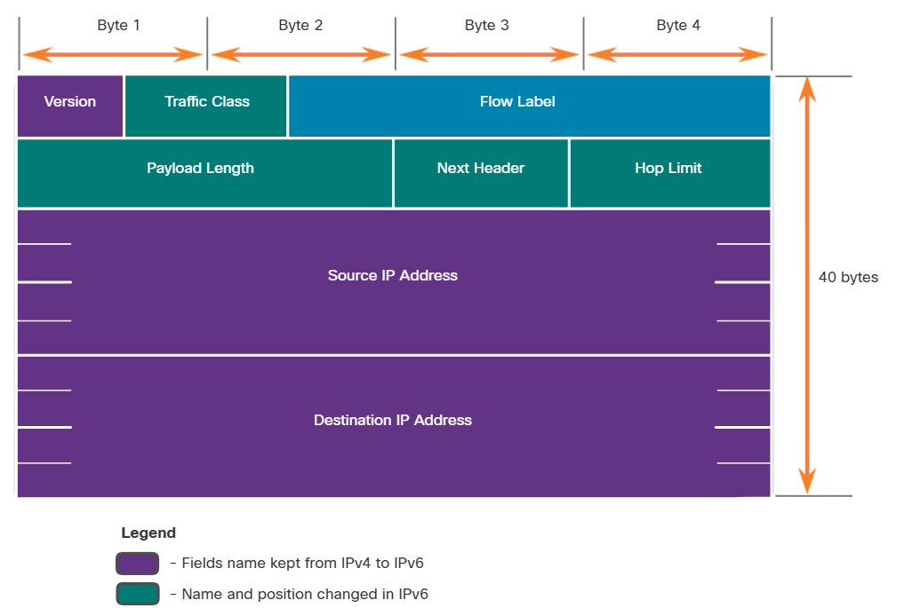

# Network Layer

Ağlar arasında end-to-end iletişimi sağlamak için network layer protokolleri dört temel işlemi gerçekleştirir;

### Addressing End Devices

Bulundukları ağda tanımlanabilmeleri için son kullanıcı cihazları daima benzersiz bir IP'ye sahip olmalıdır.

### Encapsulation 

Network layer, transport layer'dan aldığı PDU'yu paketin içine encapsulate eder. Bu encapsulate işlemi, source IP adresi ile destination IP adresi gibi bilgileri içeren bir IP header'i ekleme sürecidir. Encapsulation işlemleri source host tarafından gerçekleştirilir.

### Routing

Network layer, diğer bir ağdaki hedef hosta, paketlerin direkt olarak yönlendirilmesini sağlar. Bu süreçte routerlar, paketleri "best path" yaklaşımını kullanarak ve routing işlemini gerçekleştirerek iletir. Bu süreçte paket birden fazla routerdan geçebilir. Paketin geçtiği her bir routera "hop" adı verilir.

### De-encapsulation

Paket hedef hosta ulaştığında host, paketin IP header'ını kontrol eder. Eğer dest. IP kendi IP'si ile uyuşuyorsa IP header'i paketten kaldırılır (de-encapsulate edilir). De-encapsulation işlemi sonrasında ortaya çıkan Layer 4 PDU'su, transport layerdaki uygun hizmete iletilir. De-encapsulate işlemleri de hedef host tarafından gerçekleştirilir.

Her hostta çalışan işlemler arasındaki veri alışverişini yöneten transport layer'ın aksine network layer protokolleri, (IPv4, IPv6) verileri bir hosttan diğer bir hosta taşımak için kullanılan paketlerin yapısını ve onların işlenmesi için kullanılır. Paketlerdeki taşınan veriye bakılmaksızın çalışması, network layer'ın birden fazla host için birden fazla iletişim türüyle iletişim sağlamasına olanak tanır.

Verilerin katman katman encapsulate edilme süreci, farklı katmanlardaki hizmetlerin diğer katmanları etkilemeden gelişmesini ve ölçeklenmesini sağlar. Bu, taşıma katmanı segmentlerinin IPv4 veya IPv6 veya gelecekte geliştirilebilecek herhangi bir yeni protokol tarafından kolayca paketlenebileceği anlamına gelir.

IP header'ındaki adresleme bilgilerinin, genelde router tarafından gerçekleştirilen NAT işlemi dışında, kaynak hosttan hedef hosta ulaşana kadar aynı kaldığını da ayrıca belirtelim.

## Characteristics of IP

IP, "low overhead" yani düşük ek yüke sahip bir protokol olarak tasarlanmıştır. Ana amacı paketi kaynaktan hedefe, ağlar üzerinden veri aktarımı sağlamaktır. Dolayısıyla da bu protokol, paket akışını izlemek ve yönetmek için tasarlanmamıştır. Bu işlemler -eğer gerekirse- diğer katmanlara, özellikle de layer 4 TCP protokolüne bırakılmıştır. IP protokolünün temel özellikleri şu şekildedir;

### Connectionless

Bu özellik, IP protokolünün veri göndermeden önce herhangi özel bir uçtan uca bağlantı sağlamadığı anlamına gelir. Bunu, alıcıya haber vermeden mektup göndermek olarak düşünebilirsiniz.

### Best Effort

IP ayrıca, daha önceden kurulmuş bir bağlantıyı sürdürmek için header'ında ek alanlara ihtiyaç duymaz. Bu sayede IP'nin overhead'i önemli ölçüde azalır fakat önceden kurulmuş uçtan uca bağlantı olmadığında source hostlar, dest. hostların işlevsel olup olmadığını yani çalışıp çalışmadığının farkında olmazlar. Buna ek olarak, dest. hostların pakete erişip erişmediklerini ve okuyup okumadıklarını da bilmezler.

Yani kısaca IP protokolü, teslim edilen tüm paketlerin hedefe ulaştığını ya da alındığını garanti etmez. Ayrıca teslim edilmeyen paketleri tekrar yollamakla da ilgilenmez. Bu, IP protokolünün "unreliable" yani güvenilmez olduğunu ama "best effort" olduğunu yani en iyi çabayı desteklediğini gösterir. IP'nin best effort olması, ona hız, verimlilik ve basitlik kazandırır.

### Media Independent

IP, protokol yığınının alt katmanlarında verileri taşıyan medyadan bağımsız olarak çalışır. IP paketleri bakır kablo üzerinden elektronik sinyaller, fiber üzerinden optik sinyaller veya kablosuz olarak radyo sinyalleri olarak iletilebilir. Data link layer, IP paketlerini alıp herhangi bir media üzerinden iletilmek üzere hazırlamakla yükümlüdür. Bu IP protokolünün herhangi bir media ile sınırlı olmadığı anlamına gelir. Bunun haricinde network layer'ın media konusunda dikkate aldığı bir husus vardır. O da, her ortamın maksimum taşıyabileceği PDU boyutudur. Buna da "Maximum Transmission Unit (MTU)" denir. Data link layer ile network layer arasındaki kontrol iletişiminin bir parçası da paket için maksimum boyutun belirlenmesidir. Data link layer, MTU değerini network layer'a iletir. Network layer da bu değere göre paketlerin boyutunun ne kadar büyük olabileceğini belirler.

Bazı durumlarda, bir ara cihaz -genellikle router- bir IPv4 paketini bir media'dan daha küçük bir MTU'ya sahip başka bir media'ya iletirken bölmesi gerekir. Bu bölme ya da parçalama işlemine "fragmenting" veya "fragmentation" denir. Fragmentation gecikmeye (latency) neden olur. IPv6 paketleri ise router tarafından parçalanmaz.

## IPv4 Packet Header

Bir IPv4 packet headerı, paket hakkında önemli bilgiler içeren alanlardan (field) oluşur. Bu alanlar, Layer 3 işlemi tarafından incelenen ikili sayılar (binary) içerir.

### IPv4 Packet Header Fields

Her alanın binary değerleri, IP paketinin çeşitli ayarlarını tanımlar. Aşağıda gördüğünüz IPv4 header diyagramı diğer headarlar da olduğu gibi, soldan sağa ve yukarıdan aşağıya okunur.

Bu alanları tek tek incelemek gerekirse;

#### Version

Paketin, bir IPv4 paketi olduğunu 0100 şeklinde 4 bitlik binary ile tanımlar.

#### Differentiated Services or DiffServ (DS) / Type of Service (ToS)

Bu 8 bitlik alan, paketleri sıfırlandırmak ve önceliklendirmek için kullanılır. Örneğin VoIP paketleri genelde daha yüksek öncelik alır, çünkü sesli bir iletişimde gecikme olması istenmez. Bu alanın ilk 6 biti "Differentiated Services Code Point (DSCP)" ve son 2 biti de "Explicit Congestion Notification (ECN)" için ayrılmıştır.

#### Time to Live (TTL)

TTL, bir paketin ömrünü sınırlamak için kullanılan 8 bitlik bir binary değerdir. IPv4 paketinin çıkış noktası yani kaynağı, başlangıç TTL değerini (initial TTL value) ayarlar. Bu paket her bir router tarafından işlendiğinde, TTL değeri bir azaltılır. TTL alanı sıfıra düştüğünde, router tarafından paket droplanır ve kaynak IP adresine bir "Internet Control Message Protocol (ICMP) Time Exceeded" mesajı gönderir. Router her paketin TTL değerini azalttığı için, routerın "Header Checksum" değerini de yeniden hesaplaması gerekir.

#### Protocol

Bu 8 bitlik alan, bir üst layer protokolünü tanımlamak için kullanılır. Yani aslında paketin taşıdığı "payload"un türünü belirtir ve bu da verilerin uygun üst katman protokolüne iletilmesini sağlar. Bu alan şu şekilde değerler alabilir; ICMP (1), TCP (6) ve UDP (17).

#### Header Checksum

IPv4 başlığındaki bozulmaları tespit etmek için kullanılır. Bu hatalar routerlar tarafından kontrol edilir ve eğer bir hata söz konusuysa paket router tarafından droplanır.

Ayrıca IP header'ında, source IPv4 adresi ve destination IPv4 adresi alanları bulunur. Bunların her biri 32-bitlik değerler içerir. Bunlara ek olarak Internet Header Length (IHL), Total Length ve Header Checksum alanları paketi tanımlamak ve doğrulamak için kullanılır. Bunlar dışında kalan alanlar ise fragment edilmiş bir paketi yeniden sıralamak için kullanılır. IPv4 paketi fragmentları takip etmek için, Identification, Flags ve Fragment Offset alanlarını kullanır. Options ve Padding alanları da nadiren kullanılır.

# IPv6 Packet

Yıllar boyunca, yeni zorluklarla mücadele etmek için ek protokoller ve süreçler geliştirildi. Ancak, değişikliklere rağmen IPv4'ün hala üç büyük sorunu bulunmaktadır:

#### IPv4 Address Depletion

IPv4'ün sınırlı sayıda benzersiz genel adresi mevcuttur. Yaklaşık 4 milyar IPv4 adresi olmasına rağmen, yeni IP cihazların artan sayısı, her zaman açık olan bağlantılar ve daha az gelişmiş bölgelerin potansiyel büyümesi daha fazla adrese olan ihtiyacı artırmıştır.

#### Lack of End-to-end Connectivity

NAT, IPv4 ağlarında yaygın olarak uygulanan bir teknolojidir. NAT, birden fazla cihazın tek bir public IPv4 adresini paylaşmasına olanak tanır. Ancak, public IPv4 adresi paylaşıldığı için dahili bir ağ hostunun IPv4 adresi gizlidir. Bu, uçtan uca bağlantı gerektiren teknolojiler için sorunlu olabilir.

#### Increased network complexity

NAT, IPv4'ün ömrünü uzatmış olsa da yalnızca IPv6'ya geçiş mekanizması olarak düşünülmüştü. NAT, çeşitli uygulamalarında ağda ek karmaşıklık yaratarak gecikmeye (latency) neden oluyor ve sorun gidermeyi daha zor hale getiriyor.

1990'ların başında, Internet Engineering Task Force (IETF) IPv4 ile ilgili sorunlar konusunda endişelenmeye başladı ve bir alternatif aramaya başladı. Bu faaliyet IP sürüm 6'nın (IPv6) geliştirilmesine yol açtı. IPv6, IPv4'ün sınırlamalarını ortadan kaldırır. Mevcut ve gelecekteki ağ taleplerine daha iyi uyan özellikler sunar. Bunlar şu şekildedir;

#### Increased Address Space

IPv6 adresleri, 32 bitlik IPv4'ün aksine 128 bitlik hiyerarşik adreslemeye dayanır. Bu da daha fazla adresleme yapılabilmesine olanak tanır.

#### Improved Packet Handling

IPv6 header'i çok daha az field içerir. Bu da paketi basitleştirerek çok daha kolay işlenmesini sağlar.

#### Eliminates the Need for NAT

IPv6 adreslemesi zaten hali hazırda çok fazla adresleme imkanı sunduğundan, NAT ihtiyacını ortadan kaldırır. Bu, uçtan uca bağlantı (end-to-end connection) gerektiren uygulamaların yaşadığı NAT kaynaklı sorunların bir kısmını önler. 32 bit IPv4 adres alanı yaklaşık 4.294.967.296 benzersiz adres sağlar. IPv6 adres alanı 340.282.366.920.938.463.463.374.607.431.768.211.456 ya da kısaca 340 undesilyon adres sağlar. Bu, kabaca Dünya'daki her kum tanesine eşdeğerdir.

## IPv4 Packet Header Fields in the IPv6 Packet Header

IPv4 headerı 20 oktetlik değişken uzunlukta bir headerdan (Options alanı kullanılırsa 60 bayta kadar) ve Options alanı ve Padding alanı hariç 12 temel başlık alanından oluşur. IPv6 için bazı alanlar aynı kalmış, bazı alanların adları ve konumları değişmiş ve bazı IPv4 alanlarına artık gerek kalmamıştır.

## IPv6 Packet Header

IPv6 başlığı, 40 oktetlik sabit uzunlukta bir başlıktan oluşur (Bu uzunluk, büyük ölçüde source ve destination IPv6 adreslerinin uzunluğundan kaynaklanır). Bu basitleştirilmiş yapı, IPv6 headerlarının daha verimli işlenmesini sağlar.

#### NOT: Yukarıdaki mavi "Flow Label" IPv4'da olmayıp IPv6'te yeni gelen bir alandır.

IPv6 alanlarını daha yakından incelemek gerekirse;

### Version

Aynı IPv4'da olduğu gibi sürümün, IP version 6 olduğunu tanımlamak için 0110 olarak ayarlanmış 4 bitlik bir binary değeri içerir.

### Traffic Class

Bu 8 bitlik alan, IPv4 Differentiated Services (DS) alanına eşdeğerdir.

### Flow Label

Bu 20 bitlik alan, aynı flow label'a sahip tüm paketlerin routerlar tarafından aynı türde işleme tabi tutulmasına olanak tanır.

### Payload Length

Bu 16 bitlik alan, payload uzunluğunu belirtir. Bu IPv4 header'ının (40 byte) uzunluğunu içermez. (Payload'u anlamak için tır örneğini kafanızda canlandırabilirsiniz. Yük taşıyan bir tırın çekici kısmı header'ı temsil ederken, dorse kısmı yani asıl yükün taşındığı kısım payload'ı temsil eder.) Bunu IPv4'ün "Total Length" alanı ile karıştırmamak gerekir. Total Length alanı, header + payload uzunluğunu kapsarken, Payload Length sadece payload'un uzunluğunu kapsar. IPv4'te header'ın uzunluğunu ifade etmek için ise ayrıca "Header Length" alanı kullanılır.

### Next Header

Bu 8 bitlik alan, IPv4 "Protocol" alanına eşdeğerdir. Paketin taşıdığı payload türünü belirtir ve network layer verilerinin uygun üst katman protokolüne iletilmesini sağlar.

### Hop Limit

Bu 8 bitlik alan da IPv4 "TTL" alanı yerine kullanılır. TTL ile aynı şekilde işler ama paket bir IPv6 paketi olduğu için ICMP mesajı olarak "ICMPv6 Time Exceeded" mesajı iletilir. Bu paketin hop limiti aşıldığı için hedefine ulaşamadığını gösterir. IPv4'ün aksine, IPv6 bir IPv6 Header Checksum alanı içermez, çünkü bu işlem hem alt hem de üst layerlarda gerçekleştirilir. Bu da her hop'ta header checksum'ın tekrardan hesaplanması zahmetini ortadan kaldırarak, ağ performansını iyileştirir.

#### NOT: ICMP Timeout mesajı ile ICMP Time Exceeded mesajları farklı şeylerdir. Timeout daha genel olarak bir yanıt alınamaması halinde verilen mesajdır. Time Exceeded ise spesifik olarak, TTL veya Hop Limit aşıldığında alınan mesajdır.

Bunlarla beraber, source IPv6 ve destination IPv6 adreslerinin ikisi de ayrıca 128 bitlik alanlar içerir. Hem IPv4 header alanlarında hem de IPv6 header alanlarında, source IP adreslerinin daha önce belirtildiğini görebilirsiniz.

Ayrıca, bir IPv6 paketi, isteğe bağlı network layer bilgileri sağlayan "Extension Headers" içerebilir. Bunlar isteğe bağlıdır ve IPv6 headerı ile payload arasına yerleştirilir. Bu extension headerlar, fragmentation, güvenlik, mobility support ve daha fazlasını sağlamak için kullanılır.

