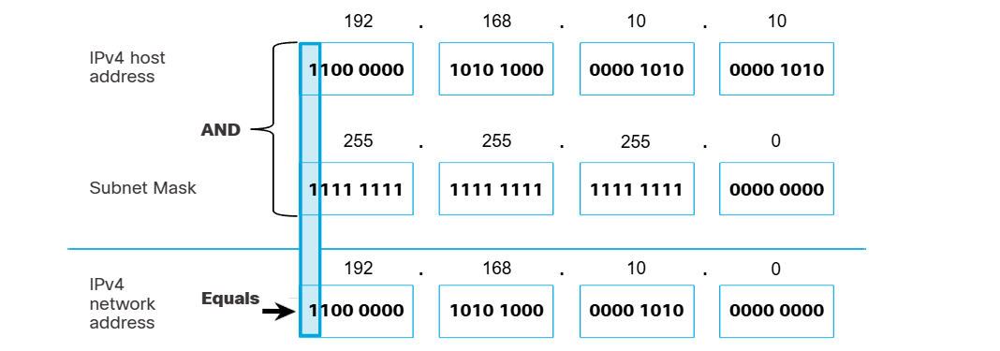

# Subnet Masks

IPv4 adreslerinin, hostun bulunduğu ağı tanımlamaya yarayan network portion'lardan ve spesifik olarak bir hostu tanımlamaya olanak tanıyan host portion'lardan oluştuğunu söylemiştik. Peki bir host, IPv4 adresinin neresinin ağı, neresinin hostu tanımladığını nereden biliyor? İşte tam bu noktada "Subnet Mask" kavramından bahsetmemiz gerekiyor.

IPv4 subnetmask'i adresin, network kısmının host kısmından ayrılmasını sağlar. Bir cihaza IPv4 adresi atandığında subnet mask, cihazın bulunduğu ağı tanımlamaya yarar. Aynı ağda yer alan cihazlar için, bu değer de aynı olacaktır. Subnet mask, IPv4 adresinin network ile host portionlarını doğrudan tanımlamaz, sadece host'a, network ve host portion için nerelere bakması gerektiğini söyler. Network ile host portionların tanımlanması için kullanılan asıl işleme ANDing denir.

Örnek; 255.255.255.0 -> bu ifadede 255 kısımları binary olarak sadece "1"lerden oluşmuştur. Bu kısımlar network portionu ifade ederken, "0"dan oluşan kısımlar ise host portionu temsil eder.

## Prefix Length

Prefix length, subnet maskleri daha rahatça ifade edebilmek için kullanılan bir yöntemdir. Prefix length, subnet mask'in 1'lerden oluşmuş kısımlarını ifade etmek için kullanılır. "Slash Notation" adı verilen gösterim kullanılarak, kaç tane bitin "1" değeri olduğunu belirtir. Örneğin; 255.0.0.0/8 gösterimi, 8 bit'in sadece 1'lerden oluştuğunu ifade eder. Bir network address'i ayrıca prefix veya network prefix olarak da adlandırıldığından prefix uzunluğu, subnet mask'teki 1 sayısına denk gelir.

## Logical AND

Logical AND, Boolean veya dijital mantıkta kullanılan üç Boolean işleminden biridir. Diğer ikisi OR ve NOT'tır. AND işlemi ağ adresini belirlemede kullanılır.

Logical AND, aşağıda gösterilen sonuçları üreten iki bitin karşılaştırılmasıdır. Sadece 1 AND 1'in 1 ürettiğine dikkat edin. Diğer herhangi bir kombinasyon 0 ile sonuçlanır.

1 AND 1 = 1

0 AND 1 = 0

1 AND 0 = 0

0 AND 0 = 0

Digital logic'te, 1 True'yu, 0 ise False'u temsil eder. AND işlemi kullanıldığında, sonucun True (1) olması için her iki giriş (input) değerinin de True (1) olması gerekir. 

Bir IPv4 hostunun ağ adresini tanımlamak için, IPv4 host adresi mantıksal olarak bit bit, subnet mask ile AND'lenir. Host adresi ile subnet mask arasındaki AND, ağ adresini verir.

İşte yukarıda görülen bu işlem bir hostun, hangi ağa ait olduğunu tanımlamak için yaptığı asıl işlemdir.

Adresler atanırken dikkat edilmesi gereken ve hiçbir hosta atılamayan adresler vardır; Bunlardan biri network adresi (ayrılmış adres bloğundaki en düşük adres), diğeri ise broadcast adresidir (" " " en yüksek adres).
