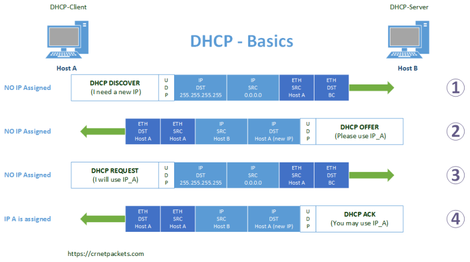

# Dynamic Host Configuration Protocol (DHCP)

IPv4 hizmeti için DHCP, IPv4 adreslerinin, subnet masklerin, default gatewaylerin ve diğer IPv4 ağ parametrelerinin otomatik olarak atanmasını sağlar. Buna dinamik adresleme (dynamic addressing) denir. Dinamik adreslemeye alternatif ise statik adreslemedir (static addressing). Statik adresleme kullanıldığında, ağ yöneticisi hostlara IP adresi bilgilerini manuel olarak girer.

Bir host ağa bağlandığında, DHCP sunucusuyla iletişim kurulur ve bir adres istenir. DHCP sunucusu, pool adı verilen yapılandırılmış bir adres aralığından bir adres seçer ve bunu hosta atar (lease yapar yani kiralar).

Daha büyük ağlarda veya kullanıcı popülasyonunun sıklıkla değiştiği yerlerde, adres ataması için DHCP tercih edilir. Yeni kullanıcılar gelebilir ve yeni bağlantılara ihtiyaç duyabilir. Her bağlantı için statik adresleme kullanmak yerine, DHCP kullanılarak IPv4 adreslerinin otomatik olarak atanması daha verimlidir.

DHCP, lease period adı verilen yapılandırılabilir bir süre için IP adresleri tahsis edebilir. Lease period önemli bir DHCP ayarıdır. Lease period sona erdiğinde veya DHCP sunucusu bir DHCPRELEASE mesajı aldığında adres yeniden kullanım için DHCP pooluna geri gönderilir. Kullanıcılar bir yerden bir yere serbestçe hareket edebilir ve DHCP aracılığıyla ağ bağlantılarını kolayca yeniden kurabilir.

Çeşitli cihaz türleri DHCP sunucusu olabilir. Çoğu orta ila büyük ağdaki DHCP sunucusu genellikle local, dedicated PC-based bir sunucudur. Ev ağlarında, DHCP sunucusu genellikle ev ağını ISP'ye bağlayan local routerde bulunur.

Birçok ağ hem DHCP hem de statik adresleme kullanır. DHCP, end user devices gibi genel amaçlı hostlar için kullanılır. Statik adresleme, gateway routers, switches, servers ve printers (bunlar genelde ağda kalıcı ve değişmeyen cihazlar olduğundan) gibi ağ cihazları için kullanılır.

IPv6 için DHCP (DHCPv6), IPv6 clientları için benzer hizmetler sağlar. Önemli bir fark, DHCPv6'nın default gateway adresi sağlamamasıdır. Bu, yalnızca yönlendiricinin "Router Advertisement" mesajından dinamik olarak elde edilebilir.

## DHCP Messages

Şekilde gösterildiği gibi, IPv4, DHCP yapılandırılmış bir cihaz boot edildiğinde veya ağa bağlandığında, bağlanan client ağdaki kullanılabilir DHCP sunucularını tanımlamak için bir DHCP discover (DHCPDISCOVER) mesajı yayınlar. Bir DHCP sunucusu, clienta bir lease teklif eden bir DHCP offer'ı (DHCPOFFER) mesajıyla yanıt verir. Offer mesajı, atanacak IPv4 adresini ve subnet maski, DNS sunucusunun IPv4 adresini ve default gatewayin IPv4 adresini içerir. Bu lease offer, ayrıca lease süresini (period) de içerir.

Yerel ağda birden fazla DHCP sunucusu varsa client birden fazla DHCPOFFER iletisi alabilir. Bu nedenle, bunlar arasından seçim yapmalı ve clientın kabul ettiği açık sunucuyu ve kiralama teklifini tanımlayan bir DHCP isteği (DHCPREQUEST) iletisi göndermelidir. Bir istemci ayrıca sunucu tarafından daha önce tahsis edilmiş bir adresi istemeyi de seçebilir. 

Talepte bulunulan IP adresleme bilgileri, istemcinin gönderdiği request mesajından sonra bile hala daha diğer hostlar tarafından kullanılabilir durumdadır. IP adresleme bilgilerinin geçerli olabilmesi için, sunucu tarafından onaylanması gerekir. Bu yüzden de sunucu istemciye kiralama sürecinin sonlandırıldığını bildiren bir DHCP acknowledgment (DHCPACK) iletisi döndürür. Teklif artık geçerli değilse, seçilen sunucu bir DHCP negative acknowledgment (DHCPNAK) iletisiyle yanıt verir. Bir DHCPNAK iletisi döndürülürse, seçim süreci yeni bir DHCPDISCOVER iletisinin iletilmesiyle yeniden başlamalıdır. İstemci lease aldıktan sonra, lease period sona ermeden önce başka bir DHCPREQUEST iletisiyle yenilenmesi gerekir.

#### NOT: Router, local ağ için bir DHCP server olarak davranabilirken aynı zamanda da bağlı olduğu WAN'da da bir DHCP client olarak davranır. Böylece, bağlı olduğu ISP'den gerekli adresleme bilgilerini (Public IP gibi) alır.

DHCPv6, DHCPv4'e benzer bir mesaj kümesine sahiptir. DHCPv6 mesajları SOLICIT, ADVERTISE, INFORMATION REQUEST ve REPLY'dır.

