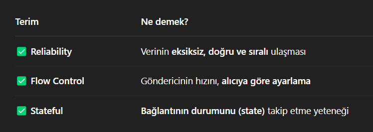
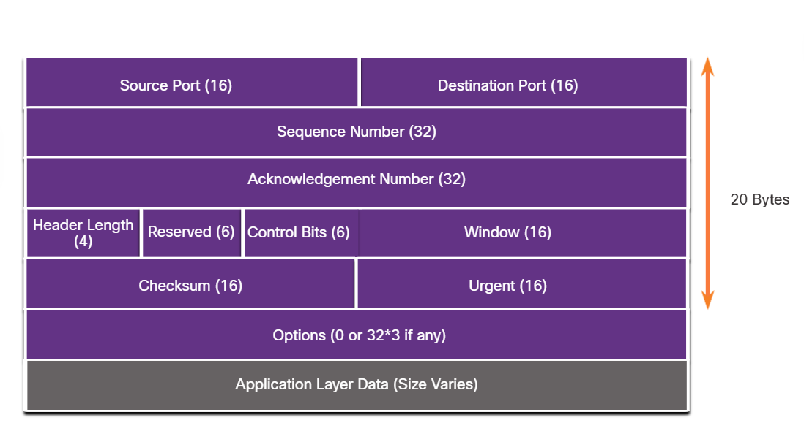
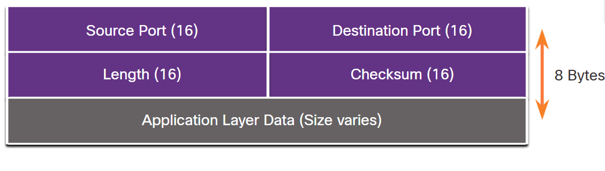
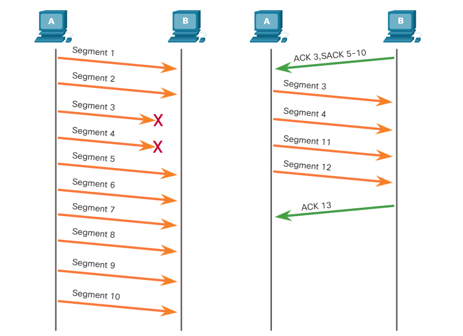
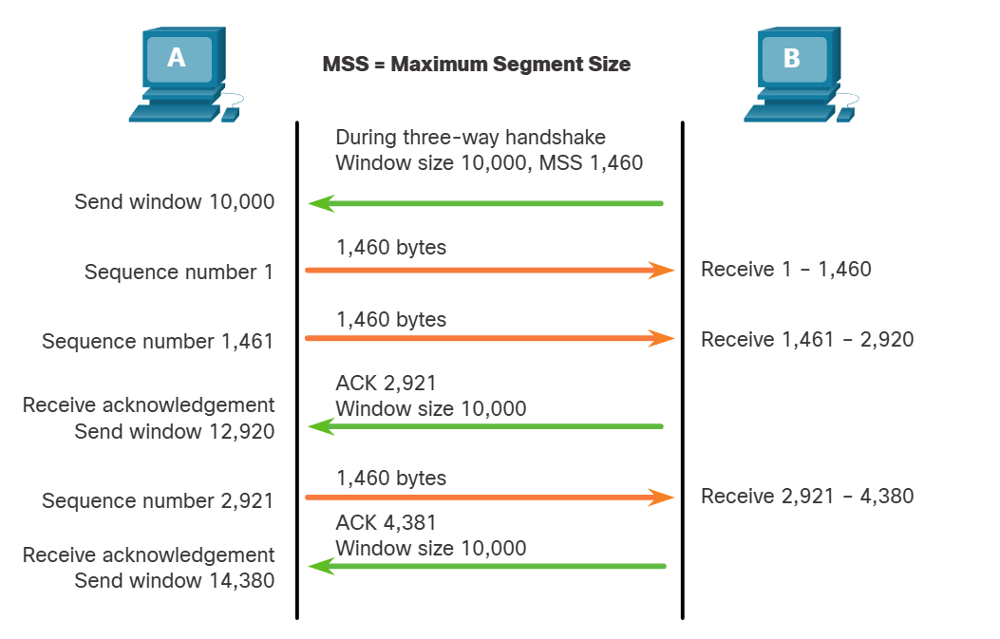

# Transport Layer

Application layerda çalışan çeşitli uygulamalar, source ve destination hostlar arasında iletilmesi gereken çeşitli veriler üretirler. Farklı hostlarda çalışan uygulamalar arasında mantıksal (logical) iletişimi sağlamak transport layer'ın görevidir. Transport layer bu iletişimi sağlarken, iki host arasında geçici bir session kurma ve uygulamalar için reliable bir iletişim sağlama prensiplerine uyarak iletişim sağlaması gerekebilir.

Transport layer, ağlarda çalışan cihazların üstündeki farklı uygulamardan, verileri çeşitli ağdalardaki ve çeşitli cihazlardaki ilgili uygulamalara taşır. Yani aslında bir nevi Network Layer ile Application Layer arasında köprü görevi görür.

Transport layer'ın hedef host türü, verilerin taşınması gereken media türü, verilerin izlediği yol, bir bağlantıdaki tıkanıklık (congestion) veya ağın boyutu hakkında bilgisi yoktur. 

Transport Layer iki tip protokolü içerir; Transmission Control Protocol (TCP) ve User Datagram Protocol (UDP)

## Transport Layer Responsibilities

### Tracking Individual Conversations

Transport Layerda, bir kaynak uygulama ile bir hedef uygulama arasında akan her veri kümesi bir "conversation" olarak bilinir ve ayrı ayrı izlenir. Bu birden fazla conversationu sürdürmek ve izlemek taşıma katmanının sorumluluğundadır. Bir cihaz aynı anda birden fazla uygulamayla iletişim kuruyor olabilir. Bu noktada transport layerın bu özelliği devreye girer. Transport layer protokolleri, ilgili uygulamaya ilgili veriyi iletebilmek için portları kullanır. Her uygulamaya özel bir port atanarak, ilgili uygulamanın ilgili veriyi alması sağlanır.

### Segmenting Data and Reassembling Segments

Çoğu ağda tek bir pakete dahil edilebilecek veri miktarı sınırlıdır. Bu nedenle, veriler yönetilebilir parçalara bölünmelidir.

Uygulama verilerini uygun büyüklükteki bloklara bölmek transport layerın sorumluluğundadır. Kullanılan transport layer protokolüne bağlı olarak transport layer blokları segment (TCP) veya datagram (UDP) olarak adlandırılır. Veriler parçalara bölünerek daha yönetilebilir ve taşınabilir olur.

#### NOT: Datagramlar, UDP tarafından bölünmez. UDP ne bölünme işlemlerinden ne de birleştirme işlemlerinden sorumludur. UDP'nin yapmadığını bu vesileyle IP yapar (MTU'ya göre). Bunun yanında segmentleri bölen protokol TCP protokolüdür. Ayrıca hedef noktada, böldüğü segmentleri sırayla birleştirmekle de sorumludur.

Hem TCP hem de UDP verilerin üstüne header ekler. Bu headerlar, veri iletişiminin fonksiyonlarını belirleyen alanları içerir. Örneğin TCP hedef hostta segmentleri birleştirmek için headerındaki alanları kullanır.

Bazen video streaming gibi yüksek bant genişliği tüketen uygulamalar, ağdaki diğer servislerin performansını olumsuz etkileyebilir. Bu durumu daha yönetilebilir hale getirmek için, transport layer’da çalışan TCP protokolü segmentation ve multiplexing kullanır.

Segmentation, büyük verilerin küçük parçalara (segment) bölünerek daha kolay taşınmasını sağlar.
Multiplexing ise, aynı cihaz üzerindeki birden fazla uygulamanın farklı port numaraları üzerinden, aynı anda veri gönderebilmesini mümkün kılar.

Örneğin, aynı anda YouTube’dan video izlerken WhatsApp’tan mesajlaştığınızı düşünün. Her ikisi de farklı uygulamalar olmasına rağmen, aynı anda çalışabiliyor — işte bu, multiplexing sayesinde mümkündür.

# Transmission Control Protocol (TCP)

TCP protokolü, UDP ve network layerda görev alan IP protokolünün aksine "reliable" bir protokoldür. TCP, verilerin hedefe ulaşıp ulaşmadığını garanti eder, eğer ulaşmadıysa da bir daha gönderir.

TCP aşağıdaki yöntemleri kullanarak, "reliability" ve "flow control" sağlar;

• Segmentler, belirli bir hosttan belirli bir uygulamaya giderken numaralandırılır ve iletim sırasında takip edilir.

• Her bir segmentin karşıya ulaşıp ulaşmadığından emin olmak için onay "acknowledgement" alır.

• Onay alınmayan (unacknowledged) segmentleri belirli bir süre sonra tekrar gönderir.

• Hedefine yanlış sırada ulaşan segmentleri doğru sıraya dizer.

• Verilerin, karşı tarafın kabul edebileceği oranda gönderilmesini sağlar. 

TCP, verileri izlemek ve conversation'un durumunu yönetebilmek için ilk olarak bir bağlantı kurması gerekir (establish connection). TCP'nin bu özelliği ona aynı zamanda connection-oriented (bağlantı odaklı) protokol denmesinin nedenidir.

# User Datagram Protocol (UDP)

UDP, TCP'ye göre çok daha basit bir protokoldür, çünkü reliability veya flow control sağlamak gibi bir derdi yoktur. Bu nedenle de header fieldları çok daha azdır. Fakat UDP datagramları, bu özelliği sayesinde TCP segmentlerinden çok daha hızlı bir şekilde işlenebilir.

TCP'nin segmentlere uygulamış olduğu segmentation işleminin aksine, UDP protokolünün datagramları bölmek gibi bir görevi yoktur. Eğer bir datagram çok büyükse ve bölünmesi gerekiyorsa (MTU'dan fazlaysa), bu işlemi IP, fragmentation yaparak bölecektir.

UDP, güvenilirlik (reliability) veya akış kontrolü (flow control) sağlamadığından, önceden kurulmuş bir bağlantıya ihtiyaç duymaz. Bu nedenle de UDP, bağlantısız (connectionless) bir protokoldür.
Ayrıca UDP, istemci ve sunucu arasında gönderilen veya alınan verileri takip etmediği için, durumsuz (stateless) bir protokol olarak da bilinir. Bu kavramların karışmaması için kısa tanımlar vermek gerekirse;

State'ten kasıt da, bağlantının hangi aşamada olduğunu bilmesidir. Örneğin en basit anlamda TCP protokolü, SYN ile bağlantı kurulduğunu, FIN ile de bağlantının kapandığını bilir. Böylece durum takibi yapmış olur. (SYN ile FIN'in ne olduğu sonra anlatılacaktır.) UDP bunların hiçbirini önemsemediğinden "stateless" bir protokoldür.

Ayrıca UDP, best-effort'u benimseyen bir protokoldür. Yani bir nevi, elinden gelenin en iyisini yapar ama verinin karşı tarafa ulaşıp ulaşmadığını garanti etmez. UDP kısaca;

🔸 Stateless               → Önceki gönderimlere dair bilgi tutulmaz

🔸 Connectionless          → Bağlantı kurulmaz (no handshake)

🔸 No Reliability          → Paket garantisi yok (no delivery guarantee)

🔸 No Acknowledgment (ACK) → Alındı bilgisi istenmez

🔸 No Retransmission       → Paket kaybolursa tekrar gönderilmez

🔸 No Flow Control         → Gönderici hızı alıcıya göre ayarlanmaz

🔸 No Congestion Control   → Ağ tıkanıklığına karşı önlem almaz

                                ↓

     ✅ **Best-Effort Delivery Model**
     
     → Paketler "elimden gelenin en iyisi" prensibiyle gönderilir,
     
     → Ulaşır mı? Sıralı mı? Tam mı? → Umursanmaz

                  
                  
  şeklinde anlatılabilir.

## The Right Transport Layer Protocol for the Right Application
  
Bazı uygulamalar bir takım verilerin kaybolmasını tolere edebilir ama oluşabilecek herhangi bir gecikmeyi (delay) kabul edemezler. Bu gibi durumlarda UDP iyi bir tercih olabilir. UDP tercihe edilebilecek uygulamalara bir örnek olarak, VoIP verilebilir. Acknowledgment, yani bir verinin ulaştığının onaylanmasını beklemek ve ulaşmadıysa da tekrar yollamak gibi işlemler gecikmeye sebep olabilir. Bu yüzden de VoIP gibi gerçek zamanlı iletişim içeren uygulamalarda bu kabul edilemez bir problemdir. 

UDP ayrıca, verinin az olduğu ve retransmission işleminin hızlı bir şekilde yapılabildiği request-reply uygulamalarında da kullanılır. Fakat bu noktada, retransmission işleminin UDP tarafından gerçekleşmediğini, onun yerine uygulama tarafından tekrar gönderim sağlandığının altını çizmekte fayda var. 2 konu önce gördüğümüz DNS sorguları bu tarzda bir iletişimdir ve burada UDP kullanılır. Örneğin istemci, bilinen bir domain name için bir DNS sunucusundan IPv4 ve IPv6 adresleri ister. İstemci önceden belirlenmiş bir süre içinde bir yanıt almazsa, isteği tekrar gönderir.

Bunun yanında TCP ise, verilerin tamamının ulaşması gerektiğini garanti eden uygulamalar için kullanılır. Örneğin, bir bankanın web sayfasındayken bilgilerinize erişim sağladığınız esnada herhangi bir veri kaybı istenmeyen bir durumdur ve bu yüzden de TCP kullanılmalıdır.

Gerçek zamanlı iletişimler, (Skype, Zoom gibi VoIP kullanan uygulamalar) çeşitli oyunlar, DNS, DHCP ve NTP protokolleri dışında ağlarda çoğunlukla -çoğu canlı yayın ve video akışın da bile- TCP kullanılır. Bunun nedenlerinden bazıları TCP'nin, buffering, bandwidth probing, congestion control gibi kullanıcı deneyimine yönelik işlevler içermesidir.

Mesela, önceden kaydedilmiş ses ve video içeriğini yayınlayan (stream eden) uygulamalar genellikle TCP kullanır.

Örneğin, bir film platformunda isteğe bağlı (on-demand) bir video izlerken ağınız aniden gerekli bant genişliğini sağlayamazsa, uygulama oynatmayı duraklatabilir.
Bu esnada ekranda "buffering..." (önbelleğe alınıyor) gibi bir mesaj görebilirsiniz.
Bu, TCP'nin veriyi mümkün olan hızla iletmeye devam ettiği sırada, uygulamanın videoyu oynatabilmesi için yeterli miktarda veriyi yeniden önbelleğe almayı beklediği anlamına gelir.
Yeterli veri yüklendiğinde ve ağ hızı belli bir seviyeye ulaştığında, video oynatıcı kaldığı yerden devam eder.

# TCP Header

TCP, yukarıda bahsettiğimiz özellikleri sağlamak için aynı diğer protokoller gibi çeşitli özelliklerini faaliyete geçirebilmesini sağlayan bir header'a ihtiyaç duyar.

## TCP Header Fields

#### Source Port -> Kaynak uygulamanın port numarasıyla ilişkilendirilmiştir.

#### Destination Port -> Hedef uygulamanın port numarasıyla ilişkilendirilmiştir.

#### Sequence Number -> Verinin tekrar birleştirilmesi için (reassembly) kullanılan kısımdır. Bu,  TCP'nin reliable, ordered delivery ve reassembly özelliklerini taşımasına olanak tanıyan alanlardan biridir.

#### Acknowledgement Number -> Bu alan, verinin alıcı tarafından alındığını ve sıradaki verinin beklendiğini belirtir. Böylece, TCP'nin reliable bir protokol olmasını sağlar.

#### Header Length -> "Data Offset" olarak da adlandırılabilir. TCP segment header'ının uzunluğunu belirtir.

#### Reserved -> Şu an aktif olarak kullanılmaz ama protokol geliştiricileri için gelecekte TCP’ye yeni bayraklar veya özellikler eklenmesi gerektiğinde kullanılmak üzere ayrılmıştır.

#### Control Bits -> TCP segmentinin amacını ve fonksiyonunu belirlemeye yarayan alandır. Bu alan bit kodlarını ya da diğer bir ismiyle flagları içerir. Daha önceden de bahsettiğimiz, SYN/ACK gibi gösterimler flag olarak adlandırılır ve TCP'nin "Stateful" olmasıyla doğrudan ilişkilidir.

#### Window Size -> Tek bir seferde alıcı tarafından kabul edilebilecek byte sayısını belirtir. Bu da doğrudan TCP'nin "Flow Control" özelliği ile ilgilidir. (İleride daha ayrıntılı bahsedilecek)

#### Checksum -> Segment headerında ya da verinin kendisinde bir hata olup olmadığının kontrolü için kullanılır.

#### Urgent -> Adın da anlaşılacağı üzere, verinin acil işlenmesi gereken kısmını tanımlar.

HTTP, FTP, SMTP, SSH gibi protokoller TCP kullanır. TCP kullanmayan uygulamaların, TCP'nin sunduğu özellikleri kendileri sağlamaları gerekebilir.

# UDP Header

Görüldüğü üzere TCP header'ından çok daha basit bir yapısı vardır. Bu da kolay işlenebilmesini sağlar.

## UDP Header Fields

#### Source Port -> Kaynak uygulamayı tanımlayan porttur.

#### Destination Port -> Hedef uygulamayı tanımlayan porttur.

#### Length -> UDP Datagram Header uzunluğudur.

#### Checksum -> Hem header hem de veri üzerinde hata kontrolü yapar.

UDP; DNS, DHCP, SNMP, VoIP gibi uygulamalarda ve flow control, error detection, acknowledgement ile error recovery gerektirmeyen ya da bunları uygulamanın kendisi bir şekilde karşılayan, uygulamalarda kullanılır.

DNS ve SNMP varsayılan olarak UDP kullansa da, her ikisi de TCP kullanabilir. DNS requesti veya DNS replyı 512 bayttan fazlaysa, örneğin bir DNS yanıtı birçok domain name resolution içeriyorsa, DNS TCP kullanır. Benzer şekilde, bazı durumlarda ağ yöneticisi SNMP'yi TCP kullanacak şekilde yapılandırmak isteyebilir.

# TCP Connection Establishment

İnsanların birbiriyle el sıkışması (handshake) nasıl bir anlaşma göstergesiyse, ağlarda da benzer şekildedir. TCP, client ile server arasında bir bağlantı kurmak için "three-way handshake" işlemini gerçekleştirmelidir. Bu işlemi şöyle açıklayalım;

#### Step 1 Synchronization (SYN)

Client, server'a, "client-to-server" oturumu talep eder.

#### Step 2 Acknowledgement and Synchronization (ACK-SYN)

Server, client'ın "client-to-server" oturumunu kabul eder ve kendisi de client'a, "server-to-client" oturumu talep eder.

#### Step 3 Acknowledgement (ACK)

Son olarak da client, server'ın, "server-to-client" oturumunu kabul eder.

Three-way handshake, server'ın iletişimde kullanılabilir olduğunu doğrulamayı sağlar.

# Session Termination

Bir bağlantı sonlandırılırken, hem "client-to-server" hem de, "server-to-client" oturumunun kapanması gerekir. Bu yüzden de, client-to-server oturumu için client, server'a header flag'inde "FIN" yazılı bir segment yollar. Server da bunu kabul ettiğini belirten "ACK" flag'li bir segment gönderir. Daha sonrasında, server-to-client oturumunu kapatmak için de aynı işlem gerçekleşir ama bu sefer "FIN" atan server'dır ve "ACK" atan da client'tır. Böylece oturum tamamen kapanmış olur.

TCP, full-duplex (çift yönlü) bir iletişim protokolüdür, yani hem istemci hem de sunucu aynı anda veri gönderebilir ve alabilir. Bu, iki tarafın birbirini beklemeden karşılıklı veri alışverişi yapabilmesini sağlar. Bunu daha iyi anlayabilmek için, iletişim türlerini netleştirmek gerekir: Simplex iletişimde veri sadece tek yönde akar; örneğin bir klavyeden bilgisayara sinyal gider ama geri dönüş olmaz. Half-duplex iletişimde veri iki yönde iletilebilir fakat aynı anda değil, taraflar sırayla konuşur; telsiz (walkie-talkie) mantığı da aynen bu şekilde işler. Oysa full-duplex iletişimde veri her iki yönde aynı anda gidebilir; örneğin telefon görüşmeleri ya da TCP bağlantıları gibi. Bu sayede TCP, veri alışverişini çift yönlü ve gerçek zamanlı şekilde yürütebilir, bu da onu güvenilir ve esnek kılar.

#### NOT: TCP'ninde aynı bir telefon görüşmesinde olduğu gibi bağlantı kurduğunu ve bu bağlantı esnasında veri alışverişi yaptığını göz önünde bulundurduğumuzda, full-duplex kavramını daha iyi oturtabiliriz.

Hostlar, TCP header bilgileri sayesinde bağlantının durumunu (state) takip edebilir. Yukarıda da bahsettiğimiz üzere, TCP header'ında bazı control bitleri (control flags) bulunur. Bunlar; SYN, ACK, FIN, RST, PSH, URG şeklinde ifade edilir. Bunlar TCP bağlantısının hangi durumda olduğunu belirtmek için kullanılan bitlerdir. Gelin bunları daha yakından inceleyelim;

#### URG (Urgent) -> Verinin içinde “acil” bir kısım olduğunu belirtir (urgent pointer alanı aktif olur).

#### ACK (Acknowledgment) -> Alınan verileri onaylamak için kullanılır (acknowledgment number alanı geçerli olur)

#### PSH (Push) -> Verinin hemen uygulamaya iletilmesini ister (yani buffer'da beklemesin der.)

#### SYN (Synchronization)-> Bağlantı başlatmak için kullanılır.

#### FIN (Finish) -> Bağlantıyı kapatmak için gönderilir (connection termination)

#### RST (Reset) -> Bağlantıyı hemen sonlandırmak (zorla kapatmak) için kullanılır (genelde hatalarda).

# TCP Sequence Numbers and Acknowledgements

TCP segmentlerinin zaman zaman hedefe ulaşmaması durumu yaşanabilir. Bazı durumlarda ise TCP segmentleri yanlış sırayla ulaşabilir. Alıcının orijinal mesajı doğru bir şekilde anlayabilmesi için, tüm verilerin eksiksiz alınması ve bu segmentlerdeki verilerin orijinal sırasına göre yeniden birleştirilmesi gerekir.
Bu amacı gerçekleştirmek için, her paketin başlığına bir sequence number (sıra numarası) atanır.
Sequence number, TCP segmentindeki ilk veri baytını temsil eder.

Oturum kurulurken, bir initial sequence number (ISN) yani başlangıç sıra numarası belirlenir.
Bu ISN, alıcı uygulamaya iletilecek baytların hangi sayıyla başlayacağını ifade eder.
Oturum sırasında veri iletildikçe, sequence number, gönderilen veri baytı sayısı kadar artırılır.
Bu veri baytı takibi, her segmentin benzersiz bir şekilde tanımlanmasını ve onaylanabilmesini (ACK) sağlar.
Bu sayede eksik segmentler tespit edilebilir. 
ISN değeri sıfırdan ya da birden başlamaz; bunun yerine etkin olarak rastgele bir sayı olarak belirlenir.
Bu, bazı kötü niyetli saldırıların önlenmesi amacıyla yapılır. Ancak örneklerde basitlik sağlamak adına ISN olarak 1 kullanılacaktır.

ACK sayısı da alıcının hangi baytları aldığını ve bundan sonra hangi baytları beklediğini gösterir. Bu da "expectational acknowledgement" olarak adlandırılır.

# TCP Reliability - Data Loss and Retransmission

TCP'nin daha sonrasında yapılan bir takım geliştirmelerden önce, sadece bir sonraki beklenen baytı onaylayabilme yeteneği vardı.
Örneğin, basitlik adına segment numaraları kullanırsak:
Host A, Host B’ye 1’den 10’a kadar olan segmentleri gönderiyor.
Eğer bu segmentlerden sadece 3 ve 4 ulaşmazsa,
Host B alıcı olarak şöyle cevap verir:

“Benim beklediğim bir sonraki segment 3’tür.”

Bu durumda, Host A diğer segmentlerin ulaşıp ulaşmadığını bilmez.
Dolayısıyla güvenli oynamak için, sadece 3 ve 4’ü değil, 3’ten 10’a kadar tüm segmentleri tekrar gönderir.

Eğer bu yeniden gönderilen segmentlerin hepsi başarıyla ulaştıysa,
önceden alınmış olan segmentler (5–10) artık duplicate (“fazlalık/çift kopya”) olur.
Bu da gereksiz gecikmelere, ağda tıkanmaya ve verimsizliğe neden olabilir.

Günümüzdeki host (bilgisayar) işletim sistemleri, genellikle SACK (Selective Acknowledgment – Seçmeli Onaylama) adı verilen isteğe bağlı bir TCP özelliği kullanır.
Bu özellik, üç yönlü el sıkışma (3-way handshake) sırasında iki taraf arasında anlaşmaya varılarak aktif edilir.

Eğer her iki taraf da SACK desteğine sahipse, alıcı taraf, hangi segmentlerin (byte'ların) alındığını açıkça belirtebilir – hatta bu segmentler ardışık olmasa bile.
Bu sayede, gönderici sadece gerçekten eksik olan verileri yeniden gönderir.

Örneğin, basitlik adına yine segment numaraları kullanırsak:
Host A, 1'den 10'a kadar olan segmentleri Host B'ye gönderir.
Eğer sadece 3 ve 4. segmentler kaybolmuşsa, Host B şunu yapabilir:

"ACK 3" ile 1 ve 2'nin alındığını bildirir

Ayrıca "SACK 5–10" ile 5’ten 10’a kadar olan segmentlerin de alındığını seçmeli olarak bildirir.

Bu durumda, Host A sadece 3 ve 4. segmentleri yeniden gönderir.

5-10 arasındaki segmentlerin de alındığı söylendiği için (5 ve 10 dahil), 3-4 segmentleri gönderildikten sonra, gönderici taraf, 11. segmentten sonrasını da göndermeye başlar.

Bir hostun diğer bir hosta segmentler gönderdiği bir senaryoda, 1. segment gönderilirken, kaynak tarafında bu segment için bir timer tutulur. Hedefin bu timer dolmadan bir ACK göndermesi gerekir. 1. segmentin hedef hosta başarılı bir şekilde ulaştığını ve hedef hostun da bunu doğrulamak için kaynağa "ACK" gönderdiğini varsayalım. Kaynak bu durumda sıradaki segment için ayrı bir timer oluşturup onu hedefe gönderecektir. Fakat bu sefer belirlenen süre içerisinde hedef bir ACK göndermez. Bundan dolayı da kaynak host segmenti hedefe bir daha gönderir. Bu daha daha önceden bahsettiğimiz gibi TCP'yi "reliable" yapan fonksiyonlarından biridir.

# TCP Flow Control - Window Size and Acknowledgments

Ayrıca TCP'nin flow control sağladığından da daha önce bahsetmiştik. Bunu header'ındaki "window size" sayesinde yapar. 

Window size, bir "ACK" alınmadan önce toplamda ne kadar bayt gönderilebileceğini belirlemek için kullanılır. Yani aslında,  bir TCP oturumunun hedef cihazının aynı anda kabul edebileceği ve işleyebileceği bayt sayısıdır.

Yukarıdaki örnekte PC B, initial window size'ın 10,000 bayt olduğunu PC A'ya bildirir. Yani 1 bayttan başlayarak, PC A'nın bir onay almadan gönderebileceği son bayt 10.000 bayttır. PC A'nın gönderebileceği window size "send window size", PC B'nin alabileceği window size "receive window size" olarak adlandırılabilir. Window size, her segment için ayrı ayrı gönderilebilir ve bu sayede de alıcı, kendi buffer durumuna göre window size değerini tekrardan belirleyebilir.

Initial window size, three-way handshake esnasında kararlaştırılır. Window size, bağlantı kurulduktan sonra da dinamik olarak güncellenebilir. Kaynak, hedefin belirlemiş olduğu window size'a göre segmentlerini göndermeli ve bu sınırı aşmamalıdır. Eğer kaynak cihaz, hedef tarafından bir ACK alırsa, o zaman yine hedefin belirlediği window size'a göre segment göndermeye devam edebilir. Yukarıdaki şekilde de görüldüğü üzere, hedef cihaz genelde, kaynak cihazın window size sınırına ulaşmasını beklemeden ACK segmentlerini gönderir. Bu davranışa “early ACK” veya “piggybacking” denebilir. Bu sayede kaynak cihaz o zamana kadar giden segmentlerin başarılı bir şekilde ulaştığını doğrulayabilir ve daha fazla bayt gönderebilir. Ya da bunun tam tersine, hedefin buffer'ının dolduğu bir senaryoda da window size'ın küçüldüğünü de belirtebilir. Bu sayede hedefin buffer durumuna göre, doğru ve dinamik bir şekilde window size belirlenebilir. İşte window size'ın hedefin buffer'ına göre dinamik olarak ayarlanması da "sliding windows" olarak adlandırılır.

Günümüzde cihazlar sliding windows özelliğini kullanır. Alıcı genellikle aldığı her iki segmentten sonra bir onay (ACK) gönderir. Onaylanmadan önce alınan segment sayısı değişebilir. Sliding windows'ların avantajı, alıcı önceki segmentleri onayladığı sürece göndericinin segmentleri sürekli olarak iletmesine izin vermesidir.

# TCP Flow Control - Maximum Segment Size (MSS)

Yine yukarıdaki şekildiği görülebileceği üzere, Maximum Segment Size (MSS), hedef cihazın alabileceği maksimum segment boyutudur. Bu cihazın, tek seferde toplamda kaç baytlık bir segment alıp işleyebileceğini belirler. Bu yüzden window size ile karıştırılmamalıdır. MSS, TCP header'ındaki options alanının bir parçasıdır. MSS boyutuna, TCP header boyutu dahil değildir. Initial window size'ın belirlenmesine benzer şekilde MSS de three-way handshake sırasında belirlenir.

IPv4 kullanıldığında yaygın bir MSS 1.460 bayttır. Bir host, MSS alanının değerini, IP ve TCP başlıklarını Ethernet Maximum Transmission Unit (MTU)'dan çıkararak belirler. Bir Ethernet arayüzünde, varsayılan MTU 1500 bayttır. 20 baytlık IPv4 başlığı ve 20 baytlık TCP başlığı çıkarılarak, varsayılan MSS boyutu şekilde gösterildiği gibi 1460 bayt olacaktır.

# TCP Flow Control - Congestion Avoidance

Ağda tıkanıklık (congestion) meydana geldiğinde, bu durum overloaded router'lar tarafından veri paketlerinin atılmasıyla (discard) sonuçlanır.
TCP segmentlerini içeren paketler hedefe ulaşamazsa, bu segmentler onaylanmadan (ACK alınmadan) kalır.

Gönderilen ancak zamanında onaylanmayan TCP segmentlerinin oranı belirlenerek, kaynak cihaz ağda belirli bir düzeyde tıkanıklık olduğunu varsayabilir.

Tıkanıklık yaşandığında, kaynak cihaz kaybolan TCP segmentlerini yeniden iletir.
Ancak, bu yeniden iletim düzgün şekilde kontrol edilmezse,

→ Ağa ek yük bindirerek tıkanıklığı daha da kötüleştirebilir.
Çünkü hem yeni TCP segmentleri ağa girer,
hem de önceki kayıpların geri bildirim (feedback) etkisiyle oluşan yeniden iletimler ağı daha fazla yükler.

TCP, tıkanıklığı önlemek ve kontrol altına almak için çeşitli tıkanıklık yönetim mekanizmaları, zamanlayıcılar (timers) ve algoritmalar kullanır.

Kaynak cihaz, TCP segmentlerinin ya hiç onaylanmadığını
ya da gecikmeli olarak onaylandığını fark ederse,

→ O zaman her bir onay (ACK) alınmadan önce gönderdiği bayt miktarını azaltabilir. (ACK alındığında ise window size tekrar belirleneceğinden dolayı ona göre hızını tekrar belirleyebilir.)

#### NOT: ACK Numbers bir sonraki beklenen baytı temsil eder, segmenti değil. Anlatım basitleştirilmek için segment ifadesi kullanılır.

Şuna dikkat edilmelidir:
Gönderilen bayt miktarını azaltan taraf kaynak cihazdır.
Bu değişiklik, hedef cihazın belirlediği window size ile ilgili değildir.

